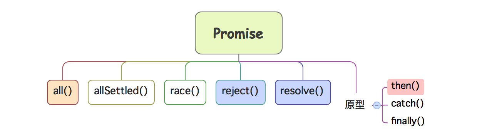

# Promise
Achieving the PromiseA+ specification



> 上面是ES6+实现的Promise核心方法，其整体结构也可以通过下面的打印查看

```javascript
  /* 01-打印Promise类的内容(静态方法) */
  console.dir(Promise)

  /* 打印输出(已经省略部分内容) */
  // length: 1                      期望形参数量((resolve,reject)=>{})
  // name: "Promise"                类(构造函数)的名字
  // prototype: Promise             原型对象
  //    then: ƒ then()              then处理函数
  //    catch: ƒ catch()            catch处理函数
  //    finally: ƒ finally()        完成的处理函数
  //    constructor: ƒ Promise()    原型的构造器属性
  // race: ƒ race()                 异步任务并发先执行完
  // reject: ƒ reject()             包装为reject     
  // resolve: ƒ resolve()           包装为resolve
  // all: ƒ all()                   异步任务并发都执行完
  // allSettled: ƒ allSettled()
  // Symbol(Symbol.species): (...)
  // Symbol(Symbol.toStringTag): "Promise"
```

> [Promises/A+](https://promisesaplus.com/) 规范约定的Promise的实现逻辑，该仓库手写 `Promise.js` 文件代码以实现[Promises/A+]() 规范。

> 核心代码
```javascript
/* 核心注解 */
/* 1、Promise应该被设计为一个类(构造函数) */
/* 2、Promise存在三种状态，分别是pending(等待)、rejected(失败) 和 resolved(成功)。*/
/* 3、Promise类(构造函数)接收一个“拥有两个函数参数的函数”作为参数，我们可以称之为执行器函数(executor),立即执行。 */
/* 4、Promise类(构造函数)内部应该以私有函数的方式来是实现reject和resolve函数。 */
/* 5、Promise内部考虑到异步任务的执行(譬如定时器)Promise状态无法立即完成等待->成功|失败的切换，因此使用注册/订阅模式 */
/* 6、Promise的then方法处理失败、成功、等待态(如果存在异步任务)的Promise后续任务。 */
/* 7、Promise的then方法应该实现链式调用，实现的策略是总是返回一个新的Promise对象 */

const PENDING = "PENDING";
const RESOLVED = "RESOLVED";
const REJECTED = "REJECTED";

function resolvePromise(promise, x, resolve, reject) {

    /* 1、死循环处理 */
    if (promise === x) {
        reject(new TypeError("# Chaining cycle detected for promise #<Promise>"))
    }

    let called = false;
    /* 2、区分返回值是基本值和(Promise)的情况*/
    if ((typeof x === "object" && x != null) || typeof x === "function") {
        try {
            let then = x.then;
            if (typeof then === "function") {
                then.call(x, y => {
                    if (called) return;
                    called = true;
                    resolvePromise(promise, y, resolve, reject); /* 递归调用 */
                }, r => {
                    if (called) return;
                    called = true;
                    reject(r);
                })
            } else {
                resolve(x);
            }
        } catch (e) {
            if (called) return;
            called = true;
            reject(e);
        }
    } else {
        resolve(x);
    }
}

class Promise {
    constructor(executor) {
        this.status = PENDING;
        this.value = this.reason = undefined;
        this.rejectedCallBacks = [];
        this.resolvedCallBacks = [];

        /* reject 和 resolve 应该被实现为私有函数 */
        let resolve = (val) => {

            if (val instanceof Promise) {
                return val.then(resolve, reject);
            }

            if (this.status === PENDING) {
                this.status = RESOLVED;
                this.value = val;
                this.resolvedCallBacks.forEach(fn => fn());
            }
        }

        let reject = (val) => {
            if (this.status === PENDING) {
                this.status = REJECTED;
                this.reason = val;
                this.rejectedCallBacks.forEach(fn => fn());
            }
        }

        /* 执行器函数应该立即执行，并进行异常处理 */
        try {
            executor(resolve, reject);
        } catch (e) {
            reject(e);
        }
    }
    then(onFulfilled, onRejected) {
        onFulfilled = typeof onFulfilled === "function" ? onFulfilled : v => v;
        onRejected = typeof onRejected === "function" ? onRejected : e => { throw e }

        let promise = new Promise((resolve, reject) => {
            if (this.status === RESOLVED) {
                setTimeout(() => {
                    try {
                        let x = onFulfilled(this.value);
                        resolvePromise(promise, x, resolve, reject);
                    } catch (e) {
                        reject(e);
                    }
                }, 0);

            }

            if (this.status === REJECTED) {
                setTimeout(() => {
                    try {
                        let x = onRejected(this.reason);
                        resolvePromise(promise, x, resolve, reject);
                    } catch (e) {
                        reject(e);
                    }
                }, 0);
            }

            if (this.status === PENDING) {
                this.rejectedCallBacks.push(() => {
                    setTimeout(() => {
                        try {
                            let x = onRejected(this.reason);
                            resolvePromise(promise, x, resolve, reject);
                        } catch (e) {
                            reject(e);
                        }
                    }, 0);
                })

                this.resolvedCallBacks.push(() => {
                    setTimeout(() => {
                        try {
                            let x = onFulfilled(this.value);
                            resolvePromise(promise, x, resolve, reject);
                        } catch (e) {
                            reject(e);
                        }
                    }, 0);
                })
            }
        })
        return promise;
    }
}

/* 基准测试 */
Promise.defer = Promise.deferred = function() {
    let dfd = {};
    dfd.promise = new Promise((resolve, reject) => {
        dfd.resolve = resolve;
        dfd.reject = reject;
    })
    return dfd;
}

module.exports = Promise;
```
> 测试方法
